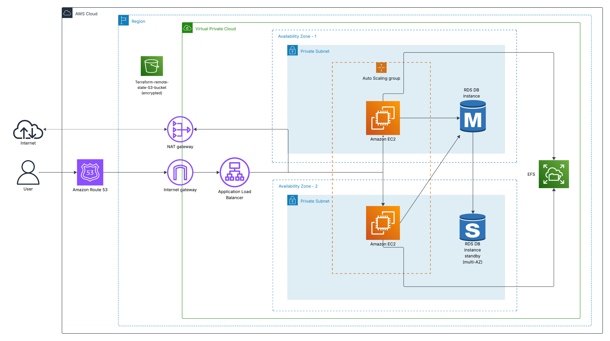

## 🔁 Highly Available aws Architecture (Reliability Pillar)


## 📌 Project Overview

This Terraform-based project provisions a fault-tolerant, production-grade web hosting stack on AWS. It includes EC2 instances behind an Auto Scaling Group and Application Load Balancer (ALB), a Multi-AZ RDS database layer, Route 53 - Simple Routing, and shared storage using Amazon EFS. The architecture is designed for high availability, scalability, and resilience—aligned with AWS's Reliability Pillar.

---
## 🖼️ Diagram 



## 🎯 Key Objectives

- 🚀 Launch Compute Layer (EC2 Auto Scaling + ALB)  
- 🗄️ Deploy Database Layer (RDS Multi-AZ)  
- 🌐 Understand the possibility of using DNS Failover with Route 53
- 📦 Integrate Shared Storage via Amazon EFS  
- 🧠 Set Up Remote State Management (S3 + DynamoDB)  
- ✅ Validate Infrastructure and Extend as Needed  
- 🧹 Clean Up Resources Post-Deployment  

---

## ✅ Prerequisites

- AWS CLI authenticated to your account  
- Terraform ≥ 1.3.0  
- Domain registered in Route 53  
- Hosted zone created (e.g., `example.com`)  

---

## 📁 Folder Structure

```bash
├── Diagram
│   └── Aws-Highly-Available-Web-Architecture.png
├── LICENSE
├── README.md
├── backend.tf
├── main.tf
├── modules
│   ├── alb
│   ├── asg
│   ├── efs
│   ├── iam
│   ├── nat_gateway
│   ├── rds
│   ├── route53
│   └── vpc
├── outputs.tf
├── state-bucket
│   └── main.tf
├── terraform.tfvars
└── variables.tf
```
---

## 🧱 Architecture Summary

| Layer       | Components                                                                  |
|------------ | ----------------------------------------------------------------------------|
| Compute     | EC2 instances in Auto Scaling Group, behind ALB                             |
| Database    | Amazon RDS (Multi-AZ, PostgreSQL/MySQL)                                     |
| Storage     | Amazon EFS mounted to EC2 instances                                         |
| Networking  | VPC with public/private subnets, NAT Gateway for outbound traffic           |
| DNS         | Route 53 hosted zone with simple routing to ALB (preferred Failover Routing)|
| Monitoring  | CloudWatch metrics, ALB health checks                                       |
| State Mgmt  | S3 backend with optional DynamoDB locking                                   |

---

## 🚀 Deployment Sequence

> ⚠️ Always initialize and apply the `state-bucket` module first. It provisions the remote backend (S3) required for Terraform state management.

```bash
# Step 1: Initialize remote state backend
terraform -chdir=state-bucket init
terraform -chdir=state-bucket plan
terraform -chdir=state-bucket apply -auto-approve

# Step 2: Deploy main infrastructure
terraform init
terraform plan
terraform apply -auto-approve
```

---

## 🔥 Teardown Sequence

```bash
# Step 1: Destroy main infrastructure
terraform destroy -auto-approve

# Step 2: destroy state backend
terraform -chdir=state-bucket destroy -auto-approve
```

---

## 🧠 Project Functionality

- VPC module provisions public/private subnets  
- NAT Gateway enables outbound traffic from private EC2s  
- EC2 module launches ASG with Apache and EFS mount  
- ALB module distributes traffic and performs health checks  
- RDS module provisions Multi-AZ database  
- Route 53 module creates A record and simple routing to ALB
- Remote state stored in S3 with optional DynamoDB locking  

---

## 🧩 Common Errors & Fixes

## ❌ Target Group Not Connected
**Cause**: EC2 instance not registered or health check failing  
**Fix**: Ensure Apache is running and responds with HTTP 200 on `/`. Check security group and target group health.

---

## ❌ Route 53 DNS Not Resolving
**Cause**: Domain nameservers don’t match hosted zone  
**Fix**:  
- Go to Route 53 → Registered Domains  
- Update nameservers to match hosted zone:
- 
---

## 🧠 Notes

- Use `prevent_destroy` on hosted zone to avoid accidental deletion  
- Validate DNS with `dig`, `nslookup`, or [dnschecker.org](https://dnschecker.org)  
- Use CloudWatch alarms for ALB and EC2 health monitoring  
- If you delete the hosted zone to save cost, update your registered domain’s nameservers accordingly  
- Simple routing is used in this project to demonstrate baseline DNS resolution and ALB integration. It’s ideal for initial deployments where traffic is directed to a single  endpoint without conditional logic.
- Failover routing is preferred in production environments to ensure high availability. It enables automatic redirection to a secondary resource (e.g., S3 static site or standby ALB) if the primary becomes unhealthy, minimizing downtime and improving resilience.
---

## 🔧 What Could Be Improved

- Add CI/CD pipeline for automated deployment 
- Upgrade from simple to failover routing for Route 53. This would allow DNS-level resilience by redirecting traffic to a backup endpoint during outages, aligning with high- availability goals.
- Integrate health checks with failover records. This ensures that Route 53 only redirects traffic when the primary resource fails, avoiding false positives and improving reliability.


